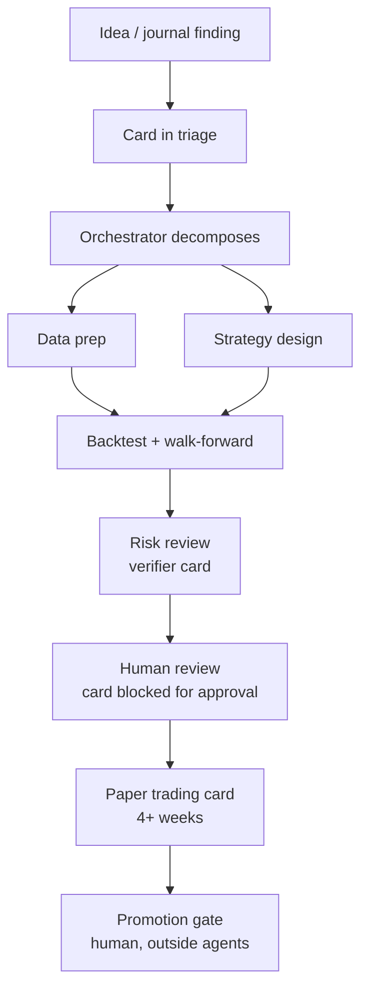
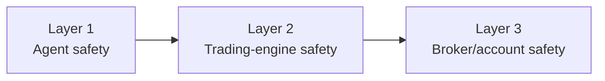
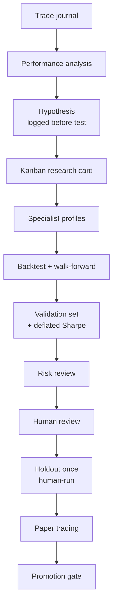

# ATLAS v3 — Hermes-Derived Autonomous Forex Trading OS (PRD)

Sep 23, 2026 · Supersedes ATLAS v2

> **Do not rebuild Hermes. Evolve it.**
> ATLAS inherits Hermes' agent infrastructure and specializes it for Forex. It builds only the missing domain chain:
> **market data → trading state → setup detection → Jev → calibration → EV → risk → sizing → MT5 → journal → validation.**
> Everything else is reused from Hermes where practical.

---

## 0. How to read this document

- **Part A (§1–§13)** defines ATLAS as a Hermes-derived agent platform: identity, reused Hermes capabilities, profiles, Kanban, MCP, skills, memory, channels, cron, token efficiency, permissions and safety.
- **Part B (§14–§24)** is the deterministic trading core carried over from v2 unchanged in substance: edge design, Jev, exits, risk, prop rules, sizing, execution, validation, operations.
- **Part C (§25–§29)** covers repository layout, roadmap, config, the capability map, and a summary of changes.

**Verification rule.** Hermes capabilities below were checked against the public Hermes documentation (Sep 2026, see Sources). I could not inspect the actual fork being used. Every "Reused" item is therefore a *requirement to verify* against the pinned fork version in Phase H0 before ATLAS depends on it. Nothing here claims a feature exists in your fork until that checklist passes.

---

# Part A — ATLAS as a Hermes-derived agent OS

## 1. Architectural identity

**ATLAS = a Hermes-derived autonomous agent platform specialized for Forex research, trading, operations and continuous improvement.**

Hermes provides the agent operating system: profiles, memory, skills, MCP, toolsets, delegation, Kanban, gateway channels, cron, config, security primitives and the learning loop. ATLAS adds the trading domain and a deterministic financial-control system that no agent can override.

```text
                         ATLAS
              Hermes-Derived Agent OS
                           │
       ┌───────────────────┼────────────────────┐
       │                   │                    │
   Agent Layer      Collaboration Layer    Interface Layer
   Profiles          Kanban boards          Telegram / Discord / Slack
   Memory            delegate_task          Web dashboard + ATLAS plugin
   Skills            Named specialists      Bot Mode roster
   Toolsets          Parallel work          CLI / TUI / Desktop
   Config            Handoffs + reviews     hermes send (script alerts)
   Learning loop     Goal-mode cards
       └───────────────────┬────────────────────┘
                           │  ATLAS MCP servers (the only bridge)
                           ▼
                  Trading Intelligence
              Jev API  ·  Market/Research data
                           │
                  ATLAS Trading Engine  (separate deterministic service)
              EV · Prop rules · Risk · Exposure · Sizing
                           │
                  MT5 Adapter → Broker   (+ broker-side SL/TP, watchdog EA)
                           │
                        Journal
```

**Two runtimes, one system.**

| Runtime | What runs there | Host | Language |
| --- | --- | --- | --- |
| Agent runtime (Hermes fork) | All ATLAS profiles, Kanban dispatcher, gateway, cron, dashboard, ATLAS MCP servers | Linux host / containers | Python (Hermes) |
| Trading runtime (ATLAS engine) | Market data, state, setups, Jev client, calibration, EV, risk, sizing, execution, reconciliation, journal writer | Windows VPS near broker (MT5 requires Windows) | Python + MQL5 watchdog |

The trading runtime is **not** a Hermes agent and contains no LLM. The agent runtime reaches it only through authenticated ATLAS MCP servers that call the engine's API. This separation is the core safety decision of v3.

## 2. Hermes capabilities reused by ATLAS

Status key: **Unchanged** = use as shipped; **Configured** = use as shipped with ATLAS-specific config, skills or profiles; **Extended** = add an ATLAS plugin, MCP server or hook on top, without patching Hermes core.

| Hermes capability | What Hermes provides | ATLAS use | Status |
| --- | --- | --- | --- |
| Profiles | Separate Hermes homes, each with its own config, `.env`, `SOUL.md`, memory, sessions, skills, cron and state DB; a `--description` used for Kanban routing | One profile per specialist role (§3) | Configured |
| Persistent memory | `MEMORY.md`, `USER.md`, cross-session search; optional external memory providers | Research knowledge per role; never authoritative for limits (§8) | Configured |
| Skills | On-demand `SKILL.md` procedures, progressive disclosure, agent-created and self-improving skills, Curator maintenance | ATLAS trading/research skills (§7) | Configured |
| MCP | Connect MCP servers, filter which tools load, filtered env for MCP subprocesses | ATLAS domain MCP servers (§6) | Extended |
| Toolsets | Per-profile and per-platform tool selection; `agent.disabled_toolsets` | First permission layer (§11) | Configured |
| Delegation | `delegate_task` spawns isolated child agents for short parallel sub-questions | In-card parallel analysis | Unchanged |
| Kanban | Durable SQLite board, named profile workers, dependencies, review, retries, circuit breaker, human comments/unblock, audit trail, boards and tenants | Research and engineering pipeline (§4) | Configured |
| Bot Mode | Profiles presented as named bots with their own chat, model, memory, skills and routines | ATLAS Researcher / Risk / Ops / Analyst bots (§9) | Configured |
| Messaging gateway | 20+ platforms, allowlists, DM pairing, per-profile gateways | Operator alerts, reports, approvals (§9) | Configured |
| Cron | Scheduled jobs with skills and delivery; script-only (no-LLM) jobs | Reports, reviews, health checks (§10) | Configured |
| Context files | `AGENTS.md`, `.hermes.md`, `CLAUDE.md`, `SOUL.md`, scanned for prompt injection | ATLAS operating rules per repo and role | Configured |
| Config system | `config.yaml` per profile; Managed Scope for admin-pinned, user-immutable config | Agent-side policy pinning (verify Managed Scope in fork) | Configured |
| Model/provider config | Multiple providers, fallback providers, credential pools, per-profile models, per-task model override | Frontier orchestrator, cheap workers (§5) | Configured |
| Programmatic tool calling | `execute_code` runs Python with RPC tool access, collapsing multi-step tool chains into one turn | Compact-state collection (§5) | Unchanged |
| Terminal backends | local, Docker, SSH, Daytona, Singularity, Modal, Vercel Sandbox | Docker backend for all agent profiles (§11) | Configured |
| Security/approvals | Dangerous-command approval (smart/manual/off), `cron_mode` / `unattended_mode` deny, `approvals.deny` rules, hardline blocklist, write denylist, container isolation, context-file scanning, egress controls | Layer 1 agent safety (§12) | Configured |
| Secrets | Bitwarden, 1Password and command-helper secret sources | Agent-side API keys only; broker creds never in Hermes | Configured |
| Hooks / observer hooks / plugins | Lifecycle hooks (incl. Kanban `task_claimed/completed/blocked`), read-only telemetry hooks, plugin system | ATLAS audit + Kanban→alert hooks | Extended |
| Web dashboard | Admin panel for config, MCP, memory, sessions, logs, cron, skills; plugin tabs (Kanban ships as one) | ATLAS dashboard tab as a dashboard plugin | Extended |
| Learning loop | Skill creation and self-improvement, memory nudges, session recall | Research-procedure learning, gated from live (§13) | Configured |
| Batch processing / trajectories | Parallel trajectory generation and export | Optional: evaluating agent research quality | Unchanged |

## 3. ATLAS specialist profiles

Each role is a real Hermes profile (its own home). Never point two running agents at the same profile — Hermes warns this corrupts memory. Profile descriptions are written carefully because the Kanban decomposer routes work by them.

| Profile | Responsibility | Model tier | Key skills | Toolsets / MCP (summary) |
| --- | --- | --- | --- | --- |
| `atlas-orchestrator` | Decompose goals into cards, route, judge completion, synthesize | Frontier | strategy-promotion, backtest-analysis | `kanban`, `memory`, `gateway` only; read-only `atlas-journal`, `atlas-performance` |
| `market-researcher` | Market structure, sessions, events, broker conditions | Cheap | forex-market-analysis | web, `atlas-market` (read), `atlas-research` |
| `strategy-researcher` | Setup hypotheses and experiment design | Mid | trend-pullback / session-breakout / liquidity-sweep research | `atlas-research`, `atlas-backtest` (dev + validation data only) |
| `backtest-engineer` | Backtester, walk-forward, robustness code | Mid (coding) | backtest-analysis, MFE-MAE-analysis | terminal (Docker), file, `atlas-backtest`, git worktrees |
| `risk-analyst` | Reviews every candidate: drawdown, Monte Carlo, prop fit | Mid | risk-review, prop-rule-analysis | `atlas-backtest` (read), `atlas-journal`, `atlas-performance` |
| `execution-engineer` | MT5 adapter, reconciliation, fills, cost model | Mid (coding) | execution-debugging, MT5-reconciliation | terminal (Docker), `atlas-operations` (read), `atlas-trading` (paper/demo only) |
| `performance-analyst` | Journal analysis, loss clusters, cost drift | Cheap | paper-trading-review, MFE-MAE-analysis | `atlas-journal`, `atlas-performance` |
| `data-engineer` | Tick/bar pipelines, data quality | Cheap (coding) | data-quality (new) | terminal (Docker), `atlas-market` (read) |
| `jev-analyst` | Calibration, Brier, keep/kill experiment | Mid | calibration-analysis | `atlas-research` (Jev replay API), `atlas-backtest` |
| `operations-monitor` | Health, alerts, incident triage | Cheap | execution-debugging, MT5-reconciliation | `atlas-operations` (read + `disable_trading`) |

Rules:

- The orchestrator's toolsets are restricted to board, memory and gateway operations so it cannot execute implementation work itself, following the Hermes Kanban guidance.
- Profiles are shipped as **profile distributions** (git-versioned `SOUL.md`, `config.yaml`, skills, cron, MCP config) so every role is reproducible and reviewable. Memories and credentials stay per-machine.
- Profiles are identity and configuration, **not a sandbox**: on the local backend an agent has the OS user's full filesystem access. Isolation comes from §11.

## 4. Kanban research organization

Hermes Kanban is ATLAS' only task system. ATLAS does not build a second one.

**Boards.** Boards are Hermes' hard isolation boundary, so ATLAS uses three:

| Board | Purpose | Who works it |
| --- | --- | --- |
| `atlas-research` | Hypotheses, experiments, backtests, calibration, strategy candidates | Research profiles, risk-analyst, orchestrator |
| `atlas-engineering` | Engine, adapter, backtester and data-pipeline code | Engineering profiles (git worktree workspaces) |
| `atlas-ops` | Incidents, reconciliation mismatches, daily/weekly reviews | operations-monitor, performance-analyst |

Tenants separate accounts within a board (`eval-firmA`, `funded-firmA`, `paper`).

**Research pipeline.**



**How Hermes Kanban features map:**

- **Card body = acceptance criteria.** Every card states hypothesis, data window (dev or validation only), metrics required and the §15 gate thresholds. Decisions shared by parallel cards (e.g. cost model version) are stamped into every card body, because workers cannot see sibling cards.
- **Structured handoffs.** Workers complete with `kanban_complete(summary, metadata)`; ATLAS standardizes metadata as `{experiment_id, strategy_version, data_window, trades, expectancy_r, pf, max_dd_mc95, dsr, artifacts[]}`. Parent results flow to child cards automatically.
- **Review.** `risk-analyst` is the verifier on every strategy card; `kanban_request_changes` routes back to the author.
- **Human-in-the-loop.** Promotion cards end in `kanban_block(kind=needs_input)`; a human comments and unblocks. The actual promotion runs outside Hermes (§12).
- **Resilience.** Retries, crash reclaim, circuit breaker and idempotency keys come from Hermes; ATLAS cron uses idempotency keys like `weekly-calibration-2026-W39`.
- **Goal-mode cards** for open-ended research ("find why GBPUSD London breakouts lost in Q3"), with explicit acceptance criteria and a turn cap.
- **Swarm topology** for fan-out analyses: N analysts → risk-analyst verifier → orchestrator synthesis.
- **Concurrency caps** (`max_in_progress`, per-profile caps) bound spend.

**Security note from Hermes docs:** Kanban dashboard plugin routes are unauthenticated and rely on binding to localhost. ATLAS never runs the dashboard on `0.0.0.0`; remote access goes through SSH tunnel or VPN only. Board contents are research data and must never contain credentials.

## 5. Agent cost and token efficiency

ATLAS minimizes model calls with a four-level hierarchy. Work always goes to the cheapest level that can do it correctly.

| Level | Executor | Used for | Model cost |
| --- | --- | --- | --- |
| 1 | Deterministic code | Indicators (EMA, ADX, ATR), spread, EV, risk, sizing, prop rules, time/session math, exposure, reconciliation, validation, DB queries, report numbers | Zero |
| 2 | Specialized services | Jev: setup probability and regime | Per-call, bounded |
| 3 | Specialist profiles | Research, debugging, analysis, experiment design, coding, report prose | Cheap/mid models |
| 4 | Orchestrator | Decomposition, cross-specialist synthesis, hard strategic calls | Frontier, rarely |

Mechanisms, all using existing Hermes features:

1. **Frontier orchestrator, inexpensive workers** — the documented Hermes Kanban cost pattern. Per-task model override pins only quality-critical cards (e.g. final strategy synthesis) to a stronger model.
2. **Coarse-grained MCP tools.** Tools return compact, pre-computed JSON (`collect_market_state`, `collect_risk_state`, `collect_position_state`, `get_experiment_summary`), never raw ticks or full journals. One call replaces many.
3. **Programmatic tool calling.** Multi-step data gathering runs inside one `execute_code` turn, then the model reasons once on the result.
4. **Script-only cron.** Health checks, reconciliation reports and threshold alerts run as no-LLM cron scripts; the model is invoked only when a script flags an anomaly.
5. **Small tool schemas.** Each profile loads only its MCP servers and filtered tools (§11); every extra tool schema costs tokens on every turn and changing MCP sets invalidates prompt cache.
6. **Skills over prompts.** Procedures live in skills loaded on demand, not in giant context files. `AGENTS.md` stays short: rules and pointers only.
7. **Narrow cards.** Each worker gets one card, its parents' handoffs and its skills — never the whole project context.
8. **Budgets.** Per-profile concurrency caps, card turn caps, and a monthly token budget per board tracked on the ATLAS dashboard.

## 6. MCP: the ATLAS capability layer

ATLAS exposes its domain to agents only through MCP servers. Each server is a thin authenticated client of the Trading Engine API or the research store; none contains trading logic.

| Server | Example tools | Access |
| --- | --- | --- |
| `atlas-market` | `collect_market_state(symbols)`, `get_bars(symbol, tf, window)`, `get_spread_stats` | Read |
| `atlas-research` | `jev_replay(state_ids)`, `list_hypotheses`, `record_hypothesis` | Read + research writes |
| `atlas-backtest` | `run_backtest(spec)`, `run_walk_forward(spec)`, `monte_carlo(run_id)`, `get_run_summary` | Dev/validation data only; holdout refused server-side |
| `atlas-journal` | `query_trades(filter)`, `mfe_mae(filter)`, `loss_clusters` | Read |
| `atlas-performance` | `performance_summary(period)`, `calibration_report`, `cost_drift` | Read |
| `atlas-operations` | `system_status`, `health_state`, `reconciliation_report`, `disable_trading(reason)` | Read + one safe write |
| `atlas-trading` | `submit_trade_intent(intent)`, `get_intent_status(id)` | Paper/demo by default (§11) |

**Hard rules:**

- `submit_trade_intent` goes through the full engine pipeline: EV → prop rules → risk → currency exposure → sizing → safety checks. The engine may reject it; the agent never sets lot size.
- There is **no** `send_raw_order`, `modify_risk`, `enable_trading` or `access_holdout` tool on any MCP server.
- Emergency tools other than `disable_trading` (e.g. `flatten_all`) live on a separate `atlas-emergency` server available only to the human operator's own profile, and the engine still requires operator authentication for them.
- Each MCP server receives its own scoped engine token via its MCP `env` config; Hermes strips all other environment variables from MCP subprocesses. Broker credentials never enter the agent runtime.
- Authorization is enforced **in the engine API by token scope**. Hermes tool filtering is a convenience layer, not the security boundary.

## 7. ATLAS trading skills

Skills are Hermes `SKILL.md` procedures, versioned in the ATLAS repo and pinned per profile. A skill is a reusable procedure, not a permanent prompt.

Required skill sections: objective, when to use, required inputs, procedure, tools, output format (including Kanban metadata shape), safety constraints, validation requirements.

```text
atlas-skills/
├── forex-market-analysis/
├── trend-pullback-research/
├── session-breakout-research/
├── liquidity-sweep-research/
├── backtest-analysis/
├── mfe-mae-analysis/
├── calibration-analysis/
├── prop-rule-analysis/
├── execution-debugging/
├── mt5-reconciliation/
├── risk-review/
├── paper-trading-review/
├── strategy-promotion/
└── data-quality/
```

Example constraint lines every research skill carries: "Never request holdout data. Report every experiment run, including failures. Output expectancy in R after costs, never total return alone."

Agent-created skills are allowed for research profiles and maintained by the Hermes Curator. New or modified skills that touch `strategy-promotion`, `risk-review` or `prop-rule-analysis` require human review before they are pinned.

## 8. Memory architecture

Memory holds **what ATLAS has learned**. Configuration and code hold **what ATLAS is allowed to do**. They never mix.

| Belongs in Hermes memory | Belongs in authoritative config/code |
| --- | --- |
| Discovered market behaviors, with evidence links | Risk limits, internal buffers |
| Past hypotheses and experiment conclusions | Prop-firm rules |
| Strategy failure patterns | Live strategy version and parameters |
| Broker quirks, execution lessons | Symbol allowlist, trading hours, blackout windows |
| Research decisions and why | Kill-switch thresholds, operator identities |

Rules:

- The Trading Engine never reads Hermes memory.
- Memory entries that state results must reference an `experiment_id` or `trade_id`; unreferenced claims are treated as notes, not findings.
- Each profile keeps its own memory (Hermes' default). Shared research knowledge is written to the research store via `atlas-research`, not by pointing two agents at one memory.

## 9. Bot Mode and channels

ATLAS uses the Hermes gateway and Bot Mode; it builds no messaging framework.

| Bot (profile) | Channel | Purpose |
| --- | --- | --- |
| ATLAS Researcher (`atlas-orchestrator`) | Telegram DM / Discord | Research requests, weekly research report, promotion requests |
| ATLAS Risk (`risk-analyst`) | Telegram group | Risk reviews, drawdown commentary |
| ATLAS Operations (`operations-monitor`) | Telegram group + email | Health, incidents, blocked cards |
| ATLAS Analyst (`performance-analyst`) | Slack or email | Daily and weekly performance reports |

There is deliberately **no "ATLAS Trader" bot that trades**. Trade and fill alerts originate from the engine and are pushed with `hermes send` or the engine's own notifier.

- Gateways use explicit user allowlists; `GATEWAY_ALLOW_ALL_USERS` is never set.
- Kanban terminal events (completed, blocked, gave_up) notify the operator's chat via subscriptions.
- **Independent alert path:** kill-switch and hard-limit alerts are sent by the engine directly (email/SMS) as well as via Hermes, so a gateway outage never silences them.

## 10. Scheduled automations

All scheduled work uses Hermes cron (or Kanban `scheduled_at`). None runs in the trading hot path.

| Schedule | Job | Type |
| --- | --- | --- |
| Every 15 min | Health check (engine, MT5, data freshness) | Script-only, LLM only on anomaly |
| Hourly | Execution and reconciliation report | Script-only |
| Server-day end | Daily performance report | Script numbers + cheap model prose |
| Daily | Loss-cluster analysis card | Kanban card → performance-analyst |
| Weekly | Calibration review | Kanban card → jev-analyst |
| Weekly | MFE/MAE analysis | Kanban card → performance-analyst |
| Weekly | Strategy performance vs expectation | Kanban card → risk-analyst |
| Monthly | Robustness and cost-model refresh | Kanban card → backtest-engineer |

Cron sessions run with `approvals.cron_mode: deny`, so a scheduled job can never auto-approve a dangerous command. **Scheduled research must never modify live risk or enable trading** — and it cannot, because no MCP tool allows it (§6).

## 11. Agent permission model

| Principal | Research | Backtest | Live data | Trade intent | Execute on MT5 | Change risk/config | Enable live |
| --- | --- | --- | --- | --- | --- | --- | --- |
| Orchestrator | Yes | Request via cards | Read | No | No | No | No |
| Strategy researcher | Yes | Yes (dev/val) | Read | No | No | No | No |
| Risk analyst | Yes | Read | Read | No | No | Propose only | No |
| Execution engineer | Yes | Yes | Read | Paper/demo only | No (engine does) | No | No |
| Operations monitor | Yes | No | Read | No | No | No | No — may **disable** only |
| Live Trading Engine | No | No | Yes | Internal signals | Yes | Reads config only | No |
| Human operator | Yes | Yes | Yes | Yes | Via engine | Yes, signed | Yes |

**Change from the requested matrix, with justification:** agent-originated trade intents are limited to paper/demo in v3. ATLAS' live edge comes from the validated deterministic pipeline; a live path for ad-hoc agent trades adds unvalidated risk and is exactly the "smart emergency decision" v1 prohibited. It can be enabled later per strategy only through the promotion gate, and even then passes every engine check.

**Enforcement layers (outer to inner):**

1. **Hermes toolsets + MCP tool filtering** per profile: agents never see tools outside their role.
2. **Engine API token scopes** per MCP server: the real authorization check, independent of any agent.
3. **OS isolation:** all agent profiles use the Docker terminal backend, run as a non-root user, with network egress allowlisted. The trading host runs no agent and accepts API calls only from the MCP host.
4. **Operator authentication outside Hermes** for enabling trading, changing risk, promotion and flattening. Hermes approval prompts are not sufficient here, because approval modes can be switched off.

## 12. Three-layer safety model



**Layer 1 — Agent safety (Hermes + ATLAS config):** profiles, toolsets, MCP filtering, Docker backend, approval modes with `cron_mode`/`unattended_mode: deny`, `approvals.deny` rules (e.g. anything touching `config/risk*`), write denylist, context-file injection scanning, gateway allowlists, egress restrictions, secrets managers.

**Layer 2 — Trading-engine safety (deterministic):** EV gate, prop rules, risk limits, currency exposure, sizing, execution validation, reconciliation, health states, kill switch. Config is loaded read-only from a directory owned by a separate OS user, checksummed, and changed only by a signed, human-approved commit.

**Layer 3 — Broker/account safety (independent):** SL and TP sent broker-side with every order, MQL5 watchdog EA that flattens on hard equity breach even if Python is dead, account-level monitoring, independent alert path.

```text
Even if an agent makes a bad decision        → the Trading Engine rejects it
Even if the Trading Engine fails             → broker-side stops and the watchdog remain
Even if research logic is wrong              → promotion gates block live deployment
Even if a Hermes approval is misconfigured   → the engine API still refuses out-of-scope calls
```

**ATLAS can think, research, collaborate, learn, communicate and operate autonomously. Deterministic financial controls remain the final authority over real-money actions.**

## 13. Autonomous learning loop



- ATLAS may freely improve **research procedures**: skills, memory, analysis methods, card templates.
- **Self-improvement never equals live-strategy modification.** Anything that changes live behavior is a new strategy version and passes every gate in §15.
- Experiment budget: 20 per strategy per month, all counted in the deflated Sharpe correction, failures included.
- Holdout data is refused by `atlas-backtest` for every agent token; only the human-run promotion script can read it.
- One change per candidate version, so improvements are attributable.

---

# Part B — Deterministic trading core (retained from v2)

## 14. Fixes carried from v2

| # | v1 issue | v2/v3 fix |
| --- | --- | --- |
| 1 | Fixed confidence gate | EV gate in R after costs (§17) |
| 2 | Tick-driven decisions | Bar-close decisions; ticks feed risk and exits only |
| 3 | Latency sold as edge | Latency is a health metric with budgets |
| 4 | Jev asked unverifiable questions | One calibrated probability + regime per setup |
| 5 | Redundant "take trade?" question | Removed; policy decides |
| 6 | Jev never benchmarked | Keep/kill vs rules-only and gradient-boosted baseline |
| 7 | Correlated pairs treated separately | Currency-exposure netting |
| 8 | Vague daily loss | Equity-based, server-time, buffered limits |
| 9 | Engine-managed stops | Broker-side SL/TP always |
| 10 | MT5 Python assumed portable | Windows VPS near broker |
| 11 | No restart reconciliation | Startup + 60 s reconciliation, idempotent IDs |
| 12 | Backtest biases unlisted | Bid/ask, variable spread, walk-forward, locked holdout |
| 13 | Unlimited research experiments | Budget + deflated Sharpe + lockbox |
| 14 | Rollover/weekend risks ignored | Blackouts and Friday flatten option |
| 15 | Exits unspecified | Dedicated exit research track |
| 16 (v3) | Agents could have unbounded access to trading | MCP-only bridge, token scopes, paper-only agent intents |
| 17 (v3) | Custom agent infra would duplicate Hermes | Reuse Hermes; build only the trading chain |

## 15. Success metrics and go/no-go gates

Primary metric: **out-of-sample expectancy per trade in R, after all costs.** Thresholds are defaults to tune, not proven values.

| Metric | Minimum to advance | Notes |
| --- | --- | --- |
| Out-of-sample trades | ≥ 300 per strategy | Separates skill from luck |
| Expectancy after costs | ≥ +0.10 R | Costs at 1.5× typical spread |
| Profit factor | ≥ 1.25 | Out-of-sample |
| Max drawdown (Monte Carlo 95th pct) | < 60% of prop max drawdown | 10,000 reshuffles |
| Daily-loss breach probability | < 2% per evaluation | Monte Carlo on daily P/L |
| Deflated Sharpe ratio | > 0.95 | Counts every experiment tried |
| Walk-forward efficiency | ≥ 50% | OOS ÷ in-sample return |
| Cost sensitivity | Positive at 2× spread | |
| Calibration (Brier) | Better than base rate | Per symbol and session |
| Paper vs backtest drift | Within ±30% | After ≥ 100 paper trades |
| Agent cost (v3) | Within monthly token budget | Tracked per board |

No phase advances on total return alone. A failing strategy returns to research, not to live at smaller size.

## 16. Edge design

Profit comes from fewer, better setups in conditions where they historically work: **setup → regime → trade selection.**

- **Setup library (deterministic):** trend pullback (H1 trend, M15 pullback, resumption entry); session breakout (Asian range at London open, retest or momentum); liquidity sweep reversal (prior-day high/low sweep closing back inside; XAUUSD and GBPUSD only after separate validation).
- **Regime filter:** ADX and EMA slope, ATR percentile vs 60-day history, session, distance to high-impact events. Setups trade only in regimes where they showed positive expectancy.
- **Trade selection (meta-labeling):** Jev or the ML baseline filters out the weakest 30–50% of setups.
- **Edge-protection rules:** spread ≤ 20% of stop distance; no entries in first 15 min after session open (unless session-based); no entries from 10 min before to 15 min after high-impact news (or per prop rules); skip 16:45–18:15 New York rollover; one position per setup per symbol; never pyramiding, averaging down, grid or martingale.

## 17. Jev integration

Jev is a specialized decision API called by the engine as `jev.evaluate_setup(setup, state)`. Agents reach Jev only through `atlas-research.jev_replay` on historical states for research.

**What backs it.** The ATLAS Jev component is not built yet and nothing here assumes an existing ATLAS model or prompt. It is built in T2, after the gradient-boosted baseline, as an adapter (`atlas_engine/adapters/jev/`) that calls TypeSafe AI's Jev, a non-generative "System One" model (text/JSON in, typed decisions with probabilities out; launched Sep 15, 2026). `p_target_first` comes from a yes/no question, `regime` from a choice question over the fixed regime labels. Vendor-stated latency is 70–500 ms end to end; ATLAS' own measurement from the trading host decides whether the 500 ms budget holds.

**Leakage rule.** Jev is a pretrained model that may have seen market history. States sent to it contain no absolute dates, timestamps, price levels or symbol-identifying news text: only normalized features (returns in ATR, distances in R, session, regime tags). Backtest and replay results for the Jev arm are treated as optimistic until confirmed in paper trading (T7).

**Input:** compact state, setup type, planned stop and target in R, spread in R, regime tags, recent strategy performance.

**Output (schema-validated):**

```json
{
  "setup_id": "SETUP-4471",
  "p_target_first": 0.58,
  "regime": "trend_normal_vol",
  "reason_codes": ["htf_aligned", "clean_pullback"],
  "model_version": "jev-2026.09.1"
}
```

- **Calibration:** isotonic regression, refit weekly on the rolling last 500 closed trades per symbol group; Brier score and reliability curves on the dashboard.
- **EV gate:** take the trade only if `EV_R = p × R_target − (1 − p) × 1 − C_R ≥ EV_min`, with EV_min = 0.15 R to start. Example: p = 0.45, 2 R target, 0.08 R cost → EV = +0.27 R, accepted.
- **Timeouts and invalid output:** > 500 ms, schema failure or out-of-range values = skip the setup, never guess.
- **Determinism:** pinned model version (never `jev-latest` in live), pinned question wording, responses cached by state hash; a model or wording change is a new strategy version.
- **No authority** over risk, lot size, prop rules, drawdown, account protection or MT5 execution. Jev never sees account balance.
- **Keep/kill experiment:** rules-only vs rules + gradient-boosted classifier vs rules + Jev on identical data; Jev stays only if it beats both out-of-sample with ≥ 300 trades per arm. Run as a Kanban swarm card owned by `jev-analyst`.

## 18. Exits and trade management

| Exit rule | Default to test | Purpose |
| --- | --- | --- |
| Fixed SL/TP (baseline) | SL 1.0–1.5 × ATR(M15) beyond structure; TP 2 R | Reference |
| Time stop | Close if not +0.5 R after 12 × M15 bars | Dead trades |
| Breakeven move | SL to entry + costs at +1 R | Test carefully; often cuts expectancy |
| Partial close | 50% at +1 R, rest trails | Smoother equity for consistency rules |
| ATR trail | 2 × ATR after +1.5 R | Trend extensions |
| Structure trail | Below last M15 swing low | Less whipsaw |
| Session exit | Before rollover or Friday 20:00 UTC | Gap/spread risk |
| Invalidation exit | H1 trend flips against position | Premise broken |

Initial SL/TP are always broker-side; management only tightens stops; at most one stop modification per bar; exits are chosen on out-of-sample expectancy and drawdown together. Every trade logs MFE and MAE.

## 19. Risk engine and prop-firm compliance

Internal limits sit well inside the firm's limits and are independent code with their own tests. No agent can configure them at runtime.

| Limit | Internal default | Action |
| --- | --- | --- |
| Daily loss (equity incl. floating, from server-day start) | 50% of firm limit | Stop new trades for the day |
| Daily loss hard stop | 75% of firm limit | Flatten, disable until next server day |
| Total / trailing drawdown | 60% of firm limit | Stop new trades, alert, human re-enable |
| Open risk (sum to SL) | 1.5% of equity | Deny new trades |
| Consecutive losses | 4 | Halve risk for next 10 trades |
| Trades per day | 6 | Deny new trades |

Each firm's rules live in `config/prop_rules/<firm>.yaml` with their own test suite: daily-loss basis and snapshot time, static vs trailing drawdown and lock point, news restrictions, weekend holding, minimum trading days, consistency rule, max lot, and whether EAs are allowed. Evaluation and funded modes are set in config by a human. ATLAS runs only on firms whose terms explicitly permit automated trading; no cross-account hedging, latency arbitrage or tick-scalping exploits.

## 20. Position sizing and currency exposure

```text
lots = (equity × risk% × m) / ((SL_distance / tick_size) × tick_value)
```

Round down to `volume_step`, clamp to `volume_min`/`volume_max` and the prop max lot, reject if rounding exceeds 110% of budget, and use `trade_tick_value_loss` where available.

- Base risk 0.25–0.5% per trade (evaluation up to 0.75% only if Monte Carlo breach odds stay under 2%).
- m = 0.5 when drawdown exceeds 50% of the internal limit, or after 4 consecutive losses.
- Optional EV scaling never exceeds base risk.
- **Currency netting:** decompose positions into legs, cap net risk per currency at 1.0% of equity; XAUUSD = −USD plus a gold bucket; weekly 60-day correlation matrix, pairs above 0.7 treated as one bet.

## 21. Execution and MT5

- **Hosting:** the `MetaTrader5` Python package is Windows-only; run it on a Windows VPS in the broker's data-center region (e.g. LD4/NY4), target ping < 20 ms. The agent runtime and Postgres live on a separate Linux host.
- **Orders:** SL/TP in the same request; strategy `magic` number; client order ID in `comment`; `order_check()` before `order_send()`; respect stops/freeze levels; filling mode from the symbol's allowed modes; deviation ≤ 2 points on majors; limit orders preferred for pullbacks; on timeout, query positions and history before any retry.
- **Reconciliation:** at startup and every 60 s; orphan policy attaches SL or closes; missing positions marked closed from deal history.
- **Time:** UTC everywhere, explicit broker-server-time conversion (UTC+2/+3 with DST); prop daily resets follow server time.
- **Cost tracking:** requested vs fill price, spread at decision and fill, commission, swap; fed back to the backtest cost model monthly.
- **Engine API:** the only entry point for intents and operations, authenticated by scoped tokens (§11); agents never connect to the MT5 terminal.

## 22. Validation pipeline

- **Data:** tick or 1-second bid/ask (e.g. Dukascopy) plus the broker's own history; 2019–present.
- **Realism:** buy at ask, sell at bid; variable spread stressed ×1.5; commission and swap; slippage from real fills; closed-bar signals only; one shared feature library for backtest and live; same-bar SL and TP → assume SL.

| Segment | Period (example) | Use |
| --- | --- | --- |
| Development | 2019–2023 | Walk-forward: train 12 months, test 3, roll |
| Validation | Jan 2024–Jun 2025 | Model/parameter selection |
| Locked holdout | Jul 2025–present | Once per candidate, human-run, before paper |

- **Robustness:** ±20% parameter neighborhood, Monte Carlo reshuffle and skip-10%, per-year and per-session breakdown (no year > 40% of profit), random-entry control with same exits.
- **Replay** of the full stack at accelerated speed must match backtest trades ≥ 95%.
- **Paper:** ≥ 4 weeks and ≥ 100 trades, expectancy within ±30% of backtest.

## 23. Operations, kill switch and watchdog

| State | Triggers (any) | Behavior |
| --- | --- | --- |
| NORMAL | All checks green | Trade normally |
| DEGRADED | Jev p95 > 500 ms; spread > 2× median; tick gap > 30 s in session | No new trades on affected symbol |
| HALT | MT5 disconnected > 60 s; reconciliation mismatch; clock drift > 2 s; DB write failure | No new trades on any symbol; alert |
| KILL | Internal hard daily-loss or drawdown limit; manual kill | Flatten, disable, human re-enable |

- Kill switch levels from v1 remain; **operations-monitor may only trigger "disable new trades"**. Flatten and re-enable require the human operator.
- MQL5 watchdog EA on the terminal flattens and disables on hard equity breach even if Python is down.
- Heartbeats every 10 s from engine, adapter and watchdog; 60 s silence pages the operator.
- No deploys with open positions or during the London/New York overlap; blue/green restart with reconciliation before re-enable.
- Hermes gateway and dashboard failures never affect trading; the engine runs fully without the agent runtime.

## 24. Journal and events

Event flow, correlation IDs (`run_id`, `state_id`, `decision_id`, `trade_id`, plus `experiment_id` and `kanban_task_id` in v3) and PostgreSQL tables from v2 carry over: `market_states`, `decisions`, `risk_checks`, `orders`, `fills`, `positions`, `trades`, `strategy_versions`, `system_events`, `latency_metrics`, `calibration_models`, `experiments`, plus v3's `trade_intents` (agent-submitted, with outcome) and `agent_actions` (every MCP write, fed by Hermes observer hooks).

---

# Part C — Build plan

## 25. Repository structure

Keep ATLAS as extensions on top of a pinned Hermes release so upstream updates stay easy to take. Patch Hermes core only when an extension point is missing, and upstream the patch where possible.

Hermes is not merged into this tree. Upstream `NousResearch/hermes-agent` is included here as the git submodule `vendor/hermes-agent`; the submodule commit is the pin. There is no ATLAS fork while no core patch is needed. If one ever is, fork Hermes into a GitHub organization (the owner's personal fork slot is taken), put the patch on an `atlas/<tag>` branch there, and point the submodule URL at it. Upstream moves too fast (thousands of commits a week) for a merged tree to stay mergeable, and everything ATLAS adds loads from outside Hermes core. The current pin and its capability check are in `docs/hermes-h0-checklist.md`.

```text
atlas/                              # this repo
├── vendor/hermes-agent/            # submodule: upstream Hermes at the pinned tag
├── AGENTS.md                       # short project rules + pointers to skills
├── atlas_engine/                   # deterministic trading runtime (Windows host)
│   ├── market_data/  state/  features/  setups/
│   ├── decisions/    calibration/  policy/
│   ├── risk/  prop_rules/  sizing/  exposure/
│   ├── execution/  positions/  reconciliation/
│   ├── api/                        # authenticated engine API (token scopes)
│   ├── journal/  events/  alerts/
│   └── adapters/  (mt5/ paper/ replay/ jev/)
├── atlas_research/                 # backtester, walk-forward, Monte Carlo, validation
├── atlas_mcp/                      # market, research, backtest, journal,
│                                   # performance, operations, trading, emergency
├── atlas_plugins/
│   ├── dashboard/                  # ATLAS tab: equity, risk, health, calibration, cost
│   └── hooks/                      # Kanban→alerts, agent_actions audit
├── atlas-profiles/                 # profile distributions, one dir per role
├── atlas-skills/                   # §7
├── watchdog/                       # MQL5 EA
├── config/                         # owned by engine OS user, read-only to agents
│   ├── risk.yaml  atlas.yaml  prop_rules/  strategies/
├── deploy/                         # docker (agents), windows (engine), systemd
├── tests/
│   ├── engine/ (unit, risk, sizing, prop, execution, failure-injection)
│   ├── mcp/ (scope and refusal tests)
│   └── replay/
└── docs/
```

## 26. Roadmap

Two tracks run in parallel from week 1: **H** (Hermes platform) and **T** (trading core). Edge discovery still comes before expensive engine work.

| Phase | Track | Build | Exit gate | Est. weeks |
| --- | --- | --- | --- | --- |
| H0. Fork + verify | H | Pin Hermes version; run the capability checklist (§2) against the fork; decide patch vs plugin per gap | Checklist signed off; gaps listed | 1 |
| H1. Profiles + boards | H | Create 10 profiles as distributions, three Kanban boards, gateway with allowlists, Docker backend | Orchestrator routes a dummy card through 3 profiles | 1 |
| T0. Edge discovery | T | Data pipeline, shared features, vectorized backtester, 2–3 setups | One setup passes dev + validation gates | 3–5 |
| H2. Read-only MCP + skills | H | `atlas-market`, `atlas-backtest`, `atlas-journal`, `atlas-performance`; first 8 skills | Holdout refusal and scope tests pass | 2 |
| T1. Exit research | T | MFE/MAE logging, exit variants (run via Kanban) | Beats fixed baseline OOS | 1–2 |
| T2. Selection layer | T | ML baseline, Jev, calibration, EV gate | Best arm beats rules-only; Brier beats base rate | 2–4 |
| T3. Risk + sizing | T | Risk engine, prop YAML, netting, full tests | 100% risk tests pass; breach < 2% | 2 |
| T4. Engine + MT5 | T | Engine API, MT5 adapter, reconciliation, watchdog EA | Failure-injection suite passes on demo | 3 |
| H3. Ops integration | H | `atlas-operations`, cron jobs, alerts, ATLAS dashboard plugin, audit hooks | Simulated incident flows end to end | 1–2 |
| T5. Replay | T | Full stack on accelerated history | ≥ 95% trade match | 1 |
| T6. Holdout | T | Human-run holdout | ≥ 50% of validation expectancy | < 1 |
| T7. Paper | T+H | Paper fills; `atlas-trading` in paper mode; daily/weekly reviews via Kanban | ≥ 4 weeks, ≥ 100 trades, drift ±30% | 4–8 |
| T8. Evaluation | T | Prop evaluation at reduced risk | No internal hard limit touched | 4–8 |
| T9. Funded | T+H | Funded config; monthly reviews | Auto-halt on 2σ underperformance | ongoing |

If T0 finds no passing setup, stop and research more — do not build the engine around a strategy without edge.

## 27. Configuration

Agent-side (per profile, Hermes `config.yaml`; host-wide rules pinned by one Managed Scope policy, because every Kanban worker inherits the dispatcher's managed directory; see `docs/h1-profiles-and-boards.md` and H0 checklist gaps G1 and G2):

```yaml
# ~/.hermes/profiles/strategy-researcher/config.yaml (excerpt)
model:
  default: "your-inexpensive-model"
terminal:
  backend: docker
approvals:
  mode: manual
  cron_mode: deny
  unattended_mode: deny
  deny:
    - "*config/risk*"
    - "*prop_rules*"
mcp_servers:
  atlas-backtest:
    command: "atlas-mcp-backtest"
    env:
      ATLAS_ENGINE_TOKEN: "<scoped research token from secret manager>"
```

Engine-side (owned by engine OS user; firm numbers blank until confirmed):

```yaml
mode: evaluation            # evaluation | funded | paper
prop_rules: prop_rules/FIRM.yaml

risk:
  risk_per_trade_pct: 0.40
  daily_loss_soft_pct_of_firm: 0.50
  daily_loss_hard_pct_of_firm: 0.75
  drawdown_stop_pct_of_firm: 0.60
  max_open_risk_pct: 1.5
  max_currency_risk_pct: 1.0
  max_trades_per_day: 6
  loss_streak_halve_after: 4

decision:
  provider: jev             # jev | gbm_baseline | rules_only
  timeout_ms: 500
  ev_min_r: 0.15
  calibration: isotonic
  calibration_window_trades: 500

filters:
  max_spread_to_stop_ratio: 0.20
  news_blackout_min: [10, 15]
  rollover_blackout_ny: ["16:45", "18:15"]
  friday_flatten_utc: "20:00"

symbols: [EURUSD, GBPUSD]   # XAUUSD after separate validation

agent_intents:
  enabled_modes: [paper, demo]   # live requires promotion + operator signature

execution:
  max_deviation_points: 2
  reconcile_interval_s: 60
```

## 28. Capability map

| Capability | Inherited from Hermes | ATLAS-specific |
| --- | --- | --- |
| Agent runtime | ✓ | Role specialization |
| Profiles | ✓ | 10 trading/research roles |
| Memory | ✓ | Trading knowledge, evidence-linked |
| Skills | ✓ | 14 trading skills |
| MCP | ✓ | 8 ATLAS MCP servers |
| Kanban | ✓ | 3 boards, research pipeline, card templates |
| Subagents / delegation | ✓ | In-card parallel analysis |
| Bot Mode + channels | ✓ | ATLAS bots, trading alerts |
| Cron | ✓ | Trading schedules |
| Configuration / Managed Scope | ✓ | Trading agent policy |
| Security primitives | ✓ | ATLAS deny rules, Docker-only profiles |
| Dashboard | ✓ (plugin system) | ATLAS dashboard tab |
| Hooks | ✓ | Audit + alert hooks |
| Jev | — | ✓ |
| Market-data engine | — | ✓ |
| Setup detector | — | ✓ |
| Calibration | — | ✓ |
| EV policy | — | ✓ |
| Risk engine | — | ✓ |
| Position sizing + exposure | — | ✓ |
| Prop rules | — | ✓ |
| Engine API with token scopes | — | ✓ |
| MT5 adapter | — | ✓ |
| Trading journal | Partial (sessions/Kanban audit) | ✓ trading schema |
| Trading watchdog | — | ✓ |
| Backtester + replay | — | ✓ |
| Promotion gates | — | ✓ |

Final architecture:

```text
                         ┌─────────────────────┐
                         │        ATLAS        │
                         │ Hermes-derived Agent│
                         └──────────┬──────────┘
       ┌────────────────────────────┼────────────────────────────┐
       ▼                            ▼                            ▼
   Profiles                     Kanban                       Skills
   Memory                       Subagents                    Toolsets
   Config                       Collaboration                MCP
   Learning                     Handoffs                     Channels
       └────────────────────────────┼────────────────────────────┘
                                    ▼
                     ATLAS MCP servers (scoped tokens)
                                    ▼
                          ATLAS Trading Intelligence
                         ┌──────────┴──────────┐
                      Jev API              Market State
                         └──────────┬──────────┘
                                    ▼
                         Deterministic Trading Engine
                         ┌──────────┼──────────┐
                        EV         Risk      Prop Rules
                         └──────────┼──────────┘
                                    ▼
                          Position Size + Exposure
                                    ▼
                               MT5 Adapter
                                    ▼
                                  Broker  ← broker-side SL/TP, watchdog EA
                                    ▼
                                 Journal
```

## 29. Summary of changes from v2

1. **Architecture changes:** ATLAS is now a Hermes fork with two runtimes — the agent runtime (Hermes) and a separate deterministic trading runtime — bridged only by authenticated MCP servers (§1, §6).
2. **Hermes capabilities reused:** profiles, memory, skills, MCP, toolsets, delegation, Kanban, Bot Mode, gateway, cron, context files, config, providers, `execute_code`, terminal backends, approvals, secrets, hooks, dashboard, learning loop (§2).
3. **ATLAS-specific capabilities built:** the trading chain from market data to journal, engine API with token scopes, MCP servers, watchdog, backtester/replay, promotion gates, dashboard plugin (§28).
4. **Profile/team design:** 10 profiles with model tiers, skills and tool scopes; orchestrator restricted to board operations (§3).
5. **Kanban workflow:** three boards, tenants per account, verifier and human-review stages, structured metadata, goal-mode and swarm cards (§4).
6. **MCP architecture:** eight domain servers, no raw-order or risk-changing tools, holdout refused server-side (§6).
7. **Jev integration:** engine-side `evaluate_setup`, research-side replay only, all v2 calibration and keep/kill requirements kept (§17).
8. **Token efficiency:** four-level hierarchy, frontier orchestrator with cheap workers, compact tools, `execute_code`, script-only cron, small schemas, skills over prompts (§5).
9. **Permission model:** matrix plus four enforcement layers; agent trade intents limited to paper/demo (§11).
10. **Live-money boundaries:** three-layer safety model; enabling, risk changes, promotion and flattening require operator auth outside Hermes (§12).
11. **Repository:** extensions on a pinned fork, config owned by a separate OS user (§25).
12. **Roadmap:** parallel H and T tracks, starting with fork verification and edge discovery (§26).

Retained from v2 without weakening: statistical gates, validation pipeline, risk and prop-firm model, sizing and netting, execution rules, reconciliation, watchdog, paper trading.

## Open questions

Answers to questions 2–7, with reasoning and sources, are in `docs/open-questions-decisions.md`.

- [x] Which Hermes version/commit is the fork pinned to, and does it include Managed Scope, Kanban swarm and goal-mode cards? **Pinned to `v2026.9.21` (`d337b736`); all three are included. See `docs/hermes-h0-checklist.md`.**
- [x] Which prop firm and account size, and do its terms explicitly allow EAs? **FTMO 2-Step, $10k first evaluation; EAs allowed.**
- [x] What is Jev (LLM, classifier, other) and its measured latency? **A future ATLAS component built in T2 after the GBM baseline, backed by TypeSafe AI's Jev API (§17). Latency is measured in T2.**
- [x] Primary timeframe: M15 intraday or H1 swing? **M15 decision bars with an H1 trend filter.**
- [ ] Broker server and VPS region? **FTMO's MT5 server; VPS region picked by ping test before T4, London by default.**
- [x] Should agent-originated trade intents ever be allowed live, and for which strategies? **No for v3; revisit only after T9.**
- [x] Who is the human operator/approver, and which channel carries approvals? **The owner is the sole operator. Telegram DM carries alerts, blocked trades, incidents and promotion requests but never authorizes anything; live enablement, risk changes, promotion and flattening use the signed operator mechanism (§11 layer 4).**

## Sources

Hermes Agent documentation, accessed Sep 23, 2026:

- [Documentation home](https://hermes-agent.nousresearch.com/docs/)
- [Docs index (llms.txt)](https://hermes-agent.nousresearch.com/docs/assets/files/llms-e0fe80d14e8d4e55c5d48b683f0f4bbf.txt)
- [Kanban multi-agent board](https://hermes-agent.nousresearch.com/docs/user-guide/features/kanban)
- [Profiles](https://hermes-agent.nousresearch.com/docs/user-guide/profiles)
- [Security](https://hermes-agent.nousresearch.com/docs/user-guide/security)
- [Repository](https://github.com/NousResearch/hermes-agent)
